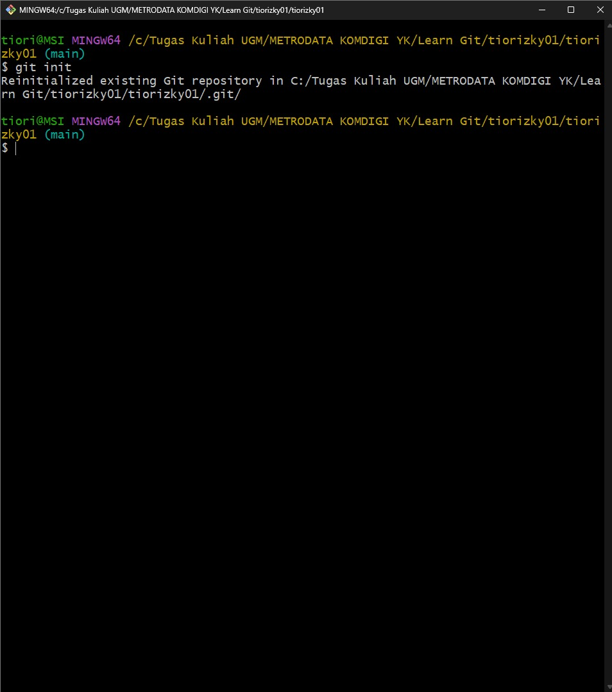

### Learning Git BPSDMP YK X METRODATA 

- Sudah Malam Atau Sudah Tau 
- Sudah Mengantuk
- sedikit lagi selesai, semangat
- ingin sekali rasanya turu
### Learning Git BPSDMP YK X METRODATA 

- Sudah Malam Atau Sudah Tau 
- Sudah Mengantuk
- ingin sekali rasanya turu

# Laporan Implementasi Git 

**Nama:** Tio Rizky Ramadhani Putra
**Email:** tiorizky01@gmail.com
**Konsep:** Implementasi alur kerja Git dengan skenario Fast-Forward Merge dan Three Way Merge.

---

## 1. Skenario Fast-Forward Merge

Skenario ini mensimulasikan pembuatan proyek baru, inisialisasi Git, pengaturan konfigurasi, pembuatan branch *Child*, dan penggabungan (*merge*) ke branch *Parent* (`main`) tanpa konflik.

### Langkah-langkah Pengerjaan

#### 1.1. Inisialisasi Repositori dan Konfigurasi Awal

1.  **Inisialisasi Repositori Git:**
    * Perintah: `git init`
    * Tujuan: Membuat repositori Git baru di direktori `C:/Tugas Kuliah UGM/METRODATA KOMDIGI YK/Learn Git`.
    

2.  **Konfigurasi Global Git:**
    * Perintah: `git config --global user.name "Tio Rizky Ramadhani Putra"` dan `git config --global user.email "tiorizky01@gmail.com"`
    * Tujuan: Menetapkan identitas pengguna Git secara global.
    * *Screenshot* Terkait: `WhatsApp Image 2025-10-15 at 01.12.37_ad77bdb5.jpg` (terlihat di output `git config --global --list` dan `WhatsApp Image 2025-10-15 at 00.57.47_52497343.jpg` (nano .gitconfig))
    

3.  **Membuat File Awal (`README.md`) dan Commit Pertama:**
    * Perintah: `code .` (membuka VS Code), lalu membuat file `README.md`, kemudian `git add .` dan `git commit -m "add: File README.md"`
    * Tujuan: Menambahkan file ke *staging area* dan membuat *commit* pertama.
    *  

4.  **Membuat Alias `git graph`:**
    * Perintah: `git config --global alias.graph "log --decorate --oneline --graph"`
    * Tujuan: Memudahkan melihat riwayat *commit* dalam bentuk grafis.
    *  

#### 1.2. Implementasi Fast-Forward Merge

1.  **Membuat Branch Child (`develop`):**
    * Perintah: `git checkout -b develop`
    * Tujuan: Membuat dan langsung berpindah ke branch baru.

2.  **Bekerja di Branch `develop`:**
    * Melakukan perubahan atau penambahan pada `README.md` dan membuat *commit* baru di branch `develop`.

3.  **Penggabungan (*Merge*) ke Branch Parent (`main`):**
    * Pindah ke branch `main`: `git checkout main`
    * Melakukan *merge* branch `develop`: `git merge develop`
    * Tujuan: Menggabungkan perubahan dari `develop` ke `main`. Karena `main` tidak memiliki *commit* baru setelah `develop` dibuat, Git akan melakukan **Fast-Forward Merge**.

4.  **Menambahkan Remote Repository:**
    * Perintah: `git remote add origin git@github.com:BPSDMP-Komdigi-Jogja-Bootcamp-Java/Learn-Git.git`
    * Tujuan: Menghubungkan repositori lokal dengan repositori di GitHub (sesuai instruksi).
     

     

---

## 2. Skenario Three Way Merge & Resolve Conflict

Skenario ini mensimulasikan pekerjaan di dua branch yang berbeda dan melakukan *merge* setelah terjadi konflik, yang kemudian harus diselesaikan secara manual (**Three Way Merge**).

### Langkah-langkah Pengerjaan

1.  **Clone Project:**
    * Perintah: `git clone git@github.com:BPSDMP-Komdigi-Jogja-Bootcamp-Java/Learn-Git.git`
    * Tujuan: Menggandakan repositori dari GitHub ke lokal (asumsi sudah dilakukan sebelumnya, atau repositori yang sama digunakan).
    *  (instruksi `git clone`).

2.  **Membuat Branch Parent & Child Baru:**
    * Diasumsikan *Parent* adalah `main` dan *Child* adalah `develop`.

3.  **Melakukan Perubahan yang Bertentangan (Konflik):**
    * Perubahan dilakukan pada baris yang sama di file yang sama (misalnya `README.md`) secara independen di branch `main` dan `develop`.

    * **Branch `main` (Perubahan 1):** *Commit* A
    * **Branch `develop` (Perubahan 2):** *Commit* B

4.  **Mengatasi Konflik:**
    * Pindah ke branch `main`: `git checkout main`
    * Melakukan *merge* branch `develop`: `git merge develop`
    * **Hasil:** Git mendeteksi konflik, dan proses *merge* terhenti.
    *  (terlihat *state* **develop** setelah konflik di VS Code dan terminal MINGW64)

5.  **Penyelesaian Konflik:**
    * Mengedit file `README.md` secara manual untuk memilih baris kode yang ingin dipertahankan atau menggabungkannya.
    .

6.  **Penyelesaian *Merge* (Commit Konflik):**
    * Perintah: `git add .` (menambahkan file yang sudah diselesaikan konfliknya) dan `git commit` (membuat *merge commit* baru).
    * Tujuan: Menyelesaikan proses **Three Way Merge** dengan *merge commit* baru.

7.  **Push ke Remote (via Pull Request):**
    * Proses *merge* dengan *Pull Request* dan *Reviewer* dilakukan melalui *platform* GitHub, yang menghasilkan *merge commit* di *remote repository*.

---

### **Lampiran (Ringkasan Log)**

Berikut adalah *log* singkat yang menunjukkan riwayat *commit* setelah *merge* skenario Fast-Forward (menggunakan alias `git graph`):

```bash
$ git graph
* cb98adf (HEAD -> main) add: File README.md
* b14e291 ignore local config file 
# ... log lainnya
